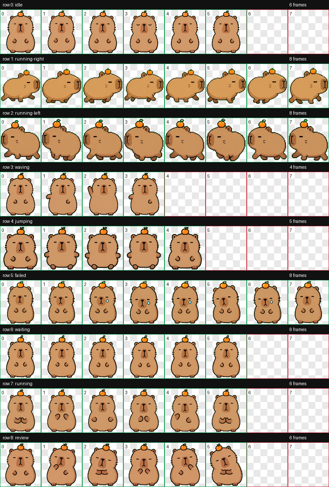
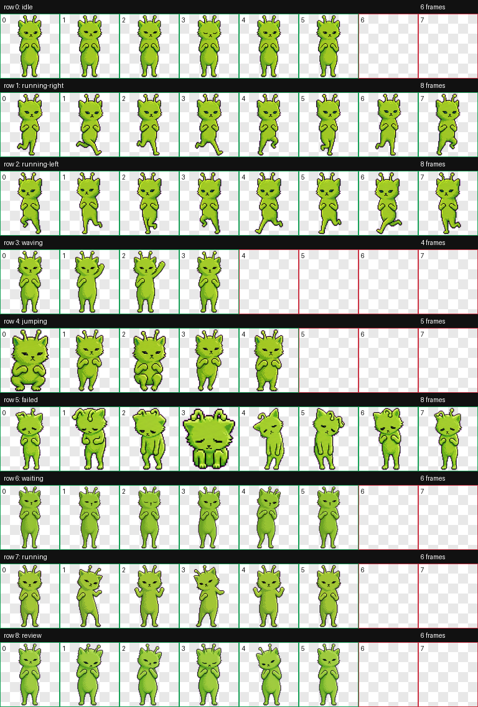

# oh my pet

Codex custom pet experiments, packaged as transparent animated spritesheets.

> Ready-to-install packages live in `pets/`. The longer `pet-runs/` folders keep
> generation artifacts, prompts, QA contact sheets, and preview videos.

This repo currently contains two pets:

| Pet | Description | Install package | QA sheet |
| --- | --- | --- | --- |
| Capy | An emotionally stable capybara with a tiny orange on its head. | `pets/capy/` | `pet-runs/capy/qa/contact-sheet.png` |
| Mossy | A slim green alien cat inspired by animated sticker references. | `pets/mossy/` | `pet-runs/mossy/run/qa/contact-sheet.png` |

## Quick Install

Copy one package folder from `pets/` into your Codex pets directory:

```powershell
$repo = "C:\path\to\oh-my-pet"
$codexPets = Join-Path $env:USERPROFILE ".codex\pets"

Copy-Item "$repo\pets\capy" "$codexPets\capy" -Recurse -Force
Copy-Item "$repo\pets\mossy" "$codexPets\mossy" -Recurse -Force
```

Then open Codex settings and choose the custom pet.

## Capy

Capy is an original round, calm capybara desktop pet. It uses a light-brown body,
thick black sprite outline, sleepy line eyes, tiny limbs, and a small orange on
its head as the stable identity marker.



The latest Capy pass specifically improves the directional walking rows and the
failed reaction:

- `running-right`: side-profile tiny walking loop with clearer foot alternation.
- `running-left`: matching side-profile walking loop in the opposite direction.
- `failed`: upright, lightly disappointed reaction with small attached tears,
  without the earlier flattened body shape.

## Mossy

Mossy is a tiny green alien cat with antennae, small paws, and a strange little
desktop-companion attitude.



Mossy's reference GIFs are from the public
[alien green cat GIF reference board](https://www.aigei.com/set/waixingxiaolvmao.html).
If you publish or redistribute this repo, check the source page's rights and
remove those references if needed.

## Install As Codex Pets

Each pet is a `pet.json` manifest plus a transparent `spritesheet.webp`.

The easiest path is to copy from `pets/`. If you want to rebuild the package
from the generation output, use this pattern for Capy on Windows:

```powershell
$petDir = Join-Path $env:USERPROFILE ".codex\pets\capy"
New-Item -ItemType Directory -Force $petDir | Out-Null

Copy-Item "pet-runs\capy\final\spritesheet.webp" `
  (Join-Path $petDir "spritesheet.webp") -Force

@'
{
  "id": "capy",
  "displayName": "Capy",
  "description": "An original emotionally stable capybara with a tiny orange on its head.",
  "spritesheetPath": "spritesheet.webp"
}
'@ | Set-Content -Encoding UTF8 (Join-Path $petDir "pet.json")
```

For Mossy, use the same pattern with `mossy` and
`pet-runs\mossy\run\final\spritesheet.webp`.

## GitHub About

The right-side GitHub **About** panel is repository metadata. It is not stored in
README. Suggested values are in `docs/github-about.md`.

## Project Layout

```text
media/                         source/reference media
pets/                          ready-to-install Codex pet packages
pet-runs/
  capy/
    decoded/                   selected generated row strips
    frames/                    extracted 192x208 animation frames
    final/                     final spritesheet PNG/WebP
    prompts/                   prompts used for base and animation rows
    qa/                        contact sheet and preview videos
    references/                run references and layout guides
  mossy/
    source-frames/             extracted source-video references
    run/                       Mossy hatch-pet run folder
```

## Validation

Both final spritesheets follow the Codex pet atlas format:

- format: `WEBP`
- mode: `RGBA`
- size: `1536x1872`
- cell size: `192x208`
- generated locally with the hatch-pet validation pipeline
- contact sheets and preview videos are included for visual review

## Notes

The `decoded/`, `frames/`, `prompts/`, and `qa/` folders are included so the
generation decisions can be reviewed later. JSON run metadata is intentionally
omitted because it can contain local filesystem paths. The installable files are
the `pet.json` manifest and `spritesheet.webp` for each pet.
